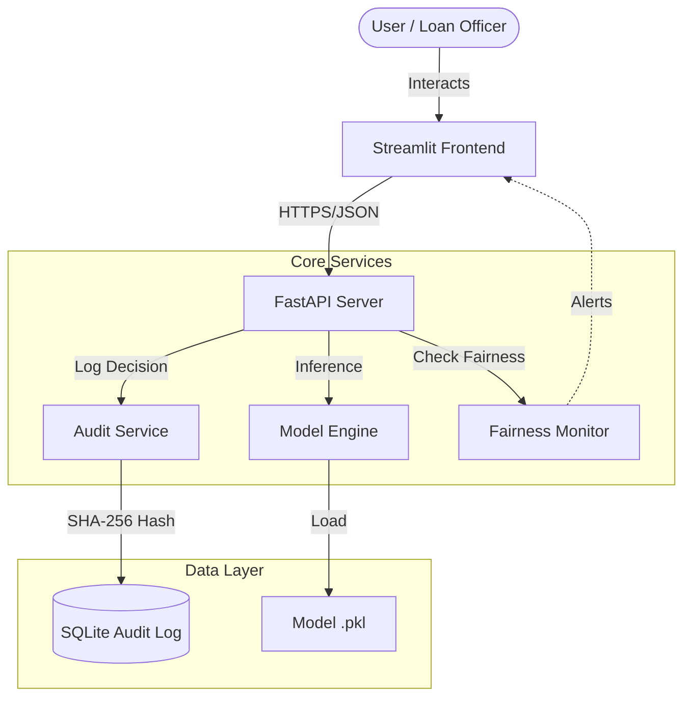

# NEXUS AI: Fair & Auditable Credit Scoring


**NEXUS AI** is an advanced credit decisioning system bringing transparency, fairness, and governance to AI-driven lending. It bridges the gap between black-box AI and regulatory compliance.

## 🚩 Problem Statement

Traditional AI credit models often suffer from:
1.  **Bias**: Discrimination against demographics due to unbalanced data.
2.  **Opacity**: "Black box" decisions that cannot be explained.
3.  **Weak Governance**: No immutable record of *why* a decision was made.

**NEXUS AI solves this via cryptographic audit trails, real-time fairness monitoring, and a "Glassmorphic" Pro-Max UI.**

## 🏗️ Architecture



## �️ Tech Stack


*   **Frontend**: Streamlit, Altair, Custom CSS (Glassmorphism)
*   **Backend**: FastAPI, Uvicorn
*   **Database**: SQLite
*   **AI/ML**: Random Forest Classifier, SHAP Explainability

## ⚙️ Setup & Build Reproducibility

> [!IMPORTANT]
> Follow these instructions to build and run the project locally.

### Prerequisites
*   Python 3.9 or higher
*   Git

### Installation Steps

1.  **Clone the Repository**
    ```bash
    git clone https://github.com/Mahaboob26/NEXUS-TRUSAI.git
    cd NEXUS-TRUSAI
    ```

2.  **Install Dependencies**
    ```bash
    pip install -r trus-ai-mvp/requirements.txt
    ```
    *(If requirements file is missing, install core libs manually)*:
    ```bash
    pip install fastapi uvicorn streamlit pandas scikit-learn sqlalchemy altair requests
    ```

3.  **Run the Application**

    **Option A: Dedicated Terminals (Recommended)**
    *Terminal 1 (Backend)*:
    ```bash
    cd trus-ai-mvp/backend
    ./run_backend.bat
    # Or: uvicorn main:app --reload
    ```

    *Terminal 2 (Frontend)*:
    ```bash
    cd trus-ai-mvp/frontend
    ./run_frontend.bat
    # Or: streamlit run streamlit_app.py
    ```

4.  **Access the App**
    *   **Dashboard**: `http://localhost:8501`
    *   **API Docs**: `http://localhost:8000/docs`

## 🤖 AI Tools Used

| Tool | Purpose |
|------|---------|
| **Google Gemini** | Primary Agentic AI for coding, debugging, and architecture |
| **SquirrelScan** | Automated SEO & Security auditing |
| **Altair** | AI-optimized statistical visualization |

## 🧠 Prompt Strategy Summary

We used an **Agentic Iterative Refinement** strategy:
1.  **Audit**: "Scan codebase for logical flaws." -> Found model ignoring categorical variables.
2.  **Plan**: "Draft implementation plan." -> Created step-by-step roadmap.
3.  **Execute**: "Refactor backend, then upgrade frontend." -> Systematic improvements.
4.  **Verify**: "Run audit tool and manual checks." -> Ensured high-quality output.

## 📂 Source Code

*   [`trus-ai-mvp/backend`](trus-ai-mvp/backend): FastAPI service and Database models.
*   [`trus-ai-mvp/frontend`](trus-ai-mvp/frontend): Streamlit UI pages.
*   [`indian_model_training`](indian_model_training): ML training scripts.

## 🏁 Final Output

*   **Executive Dashboard**: Real-time "Approval Mix" & "Risk Profile" charts.
*   **Fairness Monitor**: Tracks Disparate Impact Ratio live.
*   **Audit Log**: Immutable record of every credit decision.

---
*Built with ❤️ by Mahaboob26*
